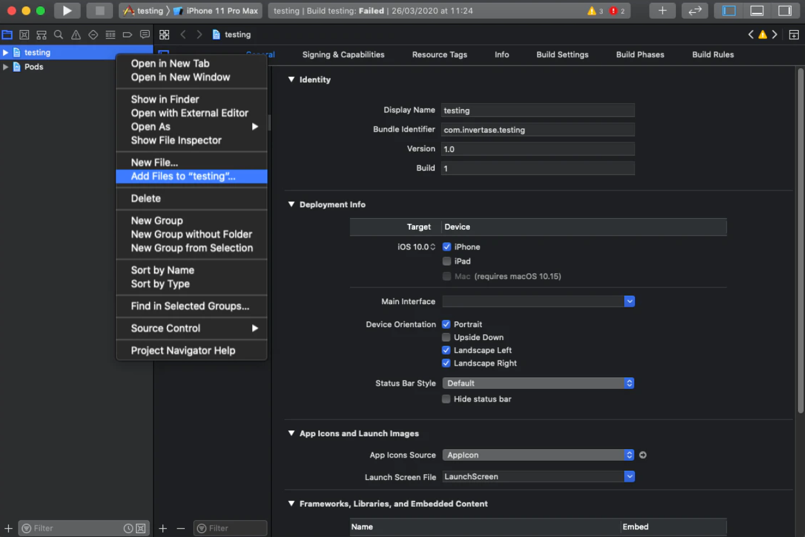
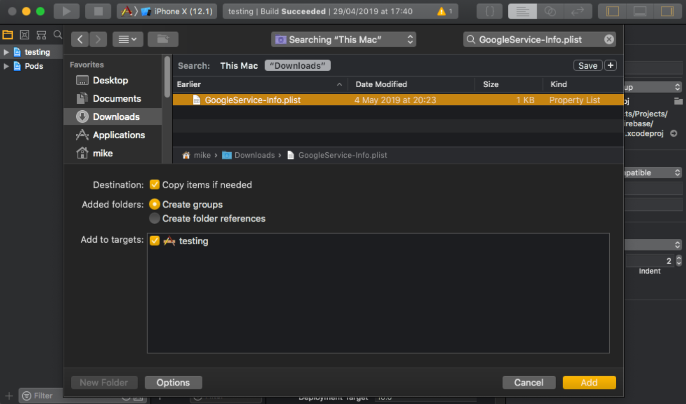

Neste documento você irá encontrar o passo a passo da instalação e configuração dos recursos do Firebase que vamos utilizar em nossa aplicação. 💜

1. [Criando um projeto no Firebase Console](https://www.notion.so/Instala-o-e-Configura-o-Firebase-939e568bc5d240f8949a6ab1cafadd43)
2. [Instalação do React Native Firebase App](https://www.notion.so/Instala-o-e-Configura-o-Firebase-939e568bc5d240f8949a6ab1cafadd43)
3. [Configuração no Android](https://www.notion.so/Instala-o-e-Configura-o-Firebase-939e568bc5d240f8949a6ab1cafadd43)
4. [Configuração no iOS](https://www.notion.so/Instala-o-e-Configura-o-Firebase-939e568bc5d240f8949a6ab1cafadd43)
5. [Instalação das demais bibliotecas](https://www.notion.so/Instala-o-e-Configura-o-Firebase-939e568bc5d240f8949a6ab1cafadd43)

---

### 1. Criando um projeto no Firebase Console

1. Primeiro, acesse o Console do Firebase para criar um novo projeto. Você pode utilizar uma conta Google para conectar-se, ou criar uma nova conta gratuita caso não tenha.

   [Firebase](https://firebase.google.com/)

2. Após acessar o Console do Firebase, clique em **"Ir para o Console"** (localizado no topo da tela, do lado direito).
3. Na próxima tela, clique no botão **"Criar um projeto"**.
4. Em seguida, **digite um nome para o seu projeto** e **clique no botão continuar**.
5. Na próxima etapa, você pode deixar o Google Analytics ativado e **clicar no botão continuar**.
6. Em Configurações do Google Analytics, selecione a opção **"Default Account for Firebase"** e clique no botão **"Criar Projeto"**.
7. Pronto! Agora é só esperar o projeto ser criado. 🎉

### 2. Instalação do React Native Firebase App

Agora, vamos instalar o módulo React Native Firebase App. Pois, ele é quem faz a conexão da nossa aplicação com o Firebase. Então, execute a instalação na raiz do projeto:

```bash
# Com npm
npm install --save @react-native-firebase/app

# Com Yarn
yarn add @react-native-firebase/app
```

### 3. Configuração no Android

1. Primeiro, vamos no console do Firebase para adicionar um novo aplicativo Android. Então, clique no **ícone do Android**.

   

1. Na tela que irá aparecer digite o nome do pacote Android que deve corresponder ao nome do pacote do seu projeto local que pode ser encontrado dentro da tag `manifest`no arquivo `/android/app/src/main/AndroidManifest.xml`.
1. Em seguida, no apelido digite "Android" e clique no botão **"Registrar app"**.
1. Faça download do arquivo `google-services.json`e coloque dentro do seu projeto no seguinte local: `/android/app/google-services.json`.
1. Agora, clique no botão "Próxima". Em seguida, clique no botão "Próxima" novamente e por fim clique no botão "Continuar no console".

   _Agora vamos configurar o código nativo que irá conecta a nossa aplicação com o Firebase._

1. Para permitir que o Firebase use as credenciais no Android, o `google-services`deve estar ativado no projeto.  Primeiro, adicione dentro do seu `/android/build.gradle`arquivo:

   ```java
   buildscript {
     dependencies {
       // ... outras dependencias
       classpath 'com.google.gms:google-services:4.3.10'
       // Adicionar a linha a cima --- /\
     }
   }
   ```

1. Agora, adicione no arquivo `/android/app/build.gradle`o seguinte:

   ```java
   apply plugin: 'com.android.application'
   apply plugin: 'com.google.gms.google-services' // <- Adicionar essa linha.
   ```

### 4. Configuração no iOS

1. Vá ao console do Firebase para adicionar um novo aplicativo iOS. Então, clique no **ícone do iOS**.
2. No console do Firebase, adicione um novo aplicativo iOS e insira os detalhes do seu projeto. O "ID do pacote iOS" deve corresponder ao ID do pacote do projeto local. O ID do pacote pode ser encontrado na guia "Geral" ao abrir o projeto com o Xcode, na linha `Bundle Identifier`.
3. Baixe o arquivo `GoogleService-Info.plist`.
4. Usando o Xcode, abra o arquivo `/ios/{projectName}.xcodeproj`do projetos (ou `/ios/{projectName}.xcworkspace`se estiver usando Pods) e clique com o botão direito no nome do projeto e em **"Adicionar arquivos" ao projeto**, conforme demonstrado abaixo:

   

   1. Selecione o `GoogleService-Info.plist`arquivo baixado do seu computador e certifique-se de que a caixa de seleção "Copiar itens se necessário" esteja marcada.

   

   1. Para permitir o Firebase use as credenciais no iOS, abra seu arquivo  `/ios/{projectName}/AppDelegate.m`e adicione a seguinte linha na parte superior do arquivo:

      ```swift
      #import <Firebase.h>
      ```

   2. Por fim, nesse mesmo arquivo, logo **após** as linhas:

      ```objectivec
      - (BOOL)application:(UIApplication *)application didFinishLaunchingWithOptions:(NSDictionary *)launchOptions
      {
      ```

      E **antes** das linhas:

      ```objectivec
      #if defined(FB_SONARKIT_ENABLED) && __has_include(<FlipperKit/FlipperClient.h>)
        InitializeFlipper(application);
      #endif
      ```

      Adicione a seguinte linha:

      ```objectivec
      [FIRApp configure];
      ```

### 5. Instalação das demais bibliotecas

Agora, vamos instalar as bibliotecas do Firebase que vamos utilizar em nosso projeto.

1. Primeiro, vamos instalar o `@react-native-firebase/app`para utilizar o banco de dados Firestore.

   ```bash
   yarn add @react-native-firebase/firestore
   ```

2. Agora, vamos instalar o `@react-native-firebase/auth`para utilizar a autenticação do Firebase.

   ```bash
   yarn add @react-native-firebase/auth
   ```

3. Vamos instalar também o `@react-native-firebase/storage`para utilizar o storage do Firebase para fazer upload de arquivos.

   ```bash
   yarn add @react-native-firebase/storage
   ```

- iOS

  1. Por fim, se você estiver no iOS instale os Pods no projeto com o comando:

     ```bash
     cd ios/ && pod install
     ```

  2. E refaça o `build` da aplicação para realizar o `autolinking` dessas bibliotecas 🎉

     ```bash
     yarn ios
     ```

- Android

  1. Por fim, refaça o `build` da aplicação para realizar o `autolinking` dessas bibliotecas 🎉

     ```bash
     yarn android
     ```
